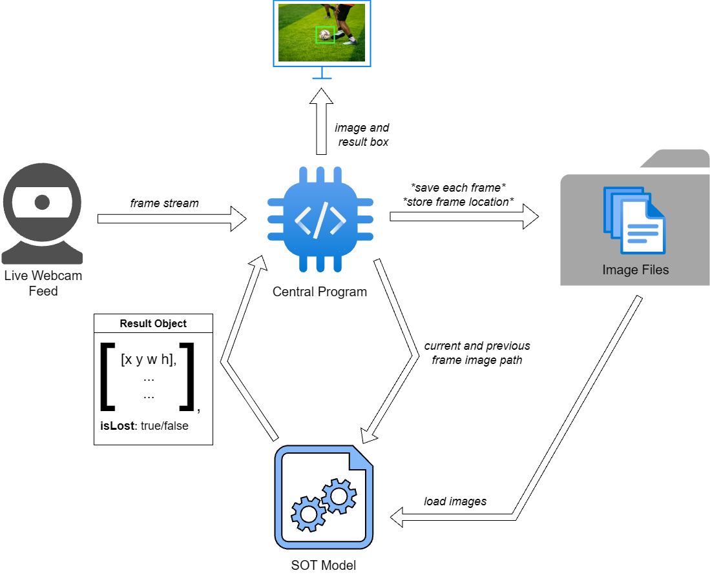

# COSC 444/544 Final Project

**Topic**: Single Object Tracking

**Team 7 Members**:

- Riley Eaton
- Wanju Luo
- Dichen Feng
- Henry Pak
- Santam Bhattacharya

## Resources

**[Final Report](documentation/final_report/Report_IEEE.pdf)**

**[Live Demo Script](src/live_webcam_capture.m)**

**[Weekly Progress Journal](documentation/progress_journal.md)**

**[Literature Review](documentation/part1/literature_review.pdf)**

**[Demo Videos](documentation/demo_videos)**

Below is a diagram of how the live demo operates:

## Instructions

In order to run the live demo, you will need to first properly install STRCF in MATLAB. To do this, follow these steps:

1. Ensure you have a C++ compiler (that is compatible with your MATLAB version). You will also need OpenCV.
2. Open the /src/STRCF folder in MATLAB
3. Run `git submodule init`
4. Run `git submodule update`
5. Run `mex -setup c++`
6. Run the install script using `install`
7. Run the test tracker with `demo_STRCF`

Once you have completed these steps, your repository will be ready to run the live demo! You just need to run the script at [`/src/live_webcam_capture.m`](/src/live_webcam_capture.m).

You can also run each of the individual trackers using the scripts found within their sub-folders. They are built to test on the OTB-2015 dataset, which you can download and place under `/src/data`.
